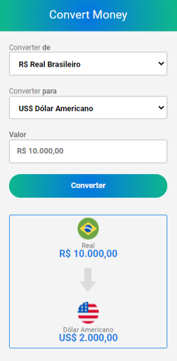

# Currency-converter

>Conversor de moeda do Real para outras moedas, por exemplo: Dólar Americano, Euro e Bitcoin.

### Ajustes e melhorias

O projeto ainda está em desenvolvimento e as próximas atualizações serão voltadas nas seguintes tarefas:

- [x] Criação do HTML
- [x] Criação do CSS
- [x] Criação do JavaScript

## 🤝 Colaboradores

Agradecemos às seguintes pessoas que contribuíram para este projeto:

<table>
  <tr>
    <td align="center">
      <a href="#">
         
        
          <b>Lucas Douglas</b>
        
      </a>
    </td>
  </tr>
</table>

